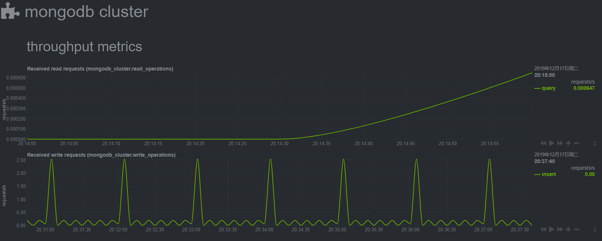

## 安装 Netdata

...

## 安装 Python 及相关库

...

需要用到 `pymongo`  库

```
pip install pymongo
```

## 修改 Netdata 配置

配置文件目录是 `/etc/netdata`

### 开启 Python 插件

```
vi /etc/netdata/netdata.conf
```

找到相关注释内容并修改为：

````
[plugins]
	python.d = yes
````

### 开启 Python 插件下的 MongoDB 模块

```
/etc/netdata/edit-config python.d.conf
```

找相关到注释内容并修改为：

```
mongodb: yes
```

### 修改 MongoDB 模块配置

```
/etc/netdata/edit-config python.d/mongodb.conf
```

找到相关注释内容（登录验证配置）修改即可：

```
# authsample:
#     name   : 'secure'
#     host   : 'mongodb.example.com'
#     port   : 27017
#     authdb : 'admin'
#     user   : 'monitor'
#     pass   : 'supersecret'
```

## 运行效果



## 问题排查

启动后无法正常显示，可以查看 Debug 信息进行问题排查：

```
/usr/libexec/netdata/plugins.d/python.d.plugin mongodb debug trace
```


