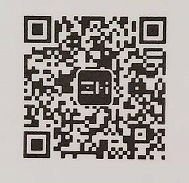
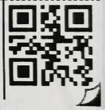
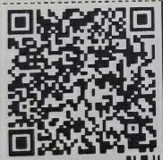
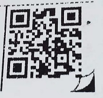

最近需要生成二维码，但不清楚二维码一般包含些怎样的内容。总感觉很神奇，只要扫一扫可以跳转网页，可以加微信好友、公众号，可以支付宝付款、加好友……于是想到解析生活中各方面的二维码看看里面究竟包含什么。

微信公众号二维码



二维码内容
```
http://weixin.qq.com/r/jHWSigDEQF0-rUTp9yCe
```


百世快递二维码



二维码内容

```
70194716438902
```

圆通速递二维码



二维码内容

```
{"mn":"805321013240983139","dtb":"378嘉兴","ssc":"378-200-03","tsc":"216","pcn":"573902","rbc":"573826","sbc":"791068"}
```

EMS二维码



二维码内容

```
yjcx.chinapost.com.cn
```

